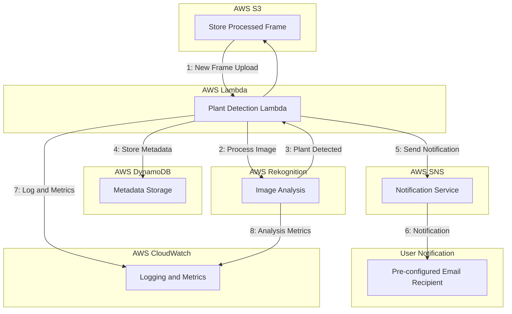

# BotanIQ

**BotanIQ** is a robust and scalable AWS-based application designed for intelligent plant detection and analysis. It leverages cloud-native technologies like AWS Rekognition, DynamoDB, and SNS to detect plants from images uploaded to S3, store metadata, and notify users. The project includes a full CI/CD pipeline, end-to-end testing, and infrastructure as code using AWS CDK.

---

## Table of Contents

- [Description](#description)
- [Diagram](#diagram)
- [Features](#features)
- [Requirements](#requirements)
- [Installation](#installation)
- [Usage](#usage)
- [Project Structure](#project-structure)
- [Testing](#testing)
- [Additional Information](#additional-information)
- [Solution Design Q&A](#solution-design-q&a)
- [Contributing](#contributing)
- [License](#license)

---

## Description

BotanIQ is built to demonstrate the power of AWS services in solving real-world problems. The application processes images uploaded to an S3 bucket, detects plants using AWS Rekognition, and stores metadata in DynamoDB. Notifications are sent via AWS SNS to inform users about the detected plants. The infrastructure is managed using AWS CDK, and the project includes automated testing with a CI/CD pipeline.

## Diagram

The following diagram illustrates the workflow of the application. It showcases the sequence of operations, key components, and decision-making logic used in the process. The flow starts from the user interaction, progresses through the system’s core functionalities, and ends with the final output or action.



## Features

- **Image Analysis**: Automatically detect plants in uploaded images using AWS Rekognition.
- **Metadata Storage**: Save detailed metadata about processed images in DynamoDB.
- **Notifications**: Notify users via SNS about plant detection results.
- **Scalable Infrastructure**: Built on AWS services, ensuring high availability and scalability.
- **Automated CI/CD**: Full pipeline for testing, deploying, and managing the application.
- **End-to-End Testing**: Comprehensive tests to ensure functionality and reliability.


## Requirements

- **Programming Language**: Python 3.9
- **AWS Services**:
  - S3
  - Rekognition
  - DynamoDB
  - SNS
  - CloudWatch
- **Infrastructure Tools**:
  - AWS CLI
  - AWS CDK
- **Dependencies**:
  - Poetry (for dependency management)
  - Moto (for mocking AWS services in tests)
  - Pytest (for testing)
  - Boto3 (AWS SDK for Python)


## Installation

### Prerequisites

1. Install [Python 3.9](https://www.python.org/downloads/).
2. Install [AWS CLI](https://aws.amazon.com/cli/) and configure it with your credentials:
   ```bash
   aws configure
3. Install Poetry for dependency management:
   ```bash
   pip install poetry
4. Clone the Repository:
   ```bash
   git clone https://github.com/your-repo/BotanIQ.git
5. Install Dependencies:
   ```bash
   poetry install

### Usage

2. Deploy the AWS infrastructure using CDK:
   ```bash
   cdk bootstrap
   cdk deploy --all
3. Upload images to the configured S3 bucket.
4. Monitor notifications for plant detection results via SNS.
5. Access logs and metadata in DynamoDB and CloudWatch for analysis.

### Project Structure

```plaintext
BotanIQ/
├── lambda_functions/        # Contains Lambda handler and utility code
├── tests/                   # Unit and E2E tests
├── cdk/                     # AWS CDK stack definitions
├── scripts/                 # Utility and setup scripts
├── poetry.lock              # Poetry lock file
├── pyproject.toml           # Poetry project configuration
└── README.md                # Project documentation
```

### Testing

**Run Unit Tests**:  
``poetry run pytest``

**Run End-to-End Tests**:  
```poetry run e2e-test```

_This project uses the Moto library to mock AWS services during tests._

### Additional Information
- **AWS Region**: Ensure that your AWS region is set correctly in the AWS_REGION environment variable or AWS CLI configuration.
- **Error Handling**: Logs and errors are published to CloudWatch.
- **Security**: Sensitive information such as AWS credentials is managed securely using environment variables and secrets.

## Solution Design Q&A

### 1. Modify the Solution to Tag Frames for Future Research Instead of Sending Emails

- Replace the email notification step with a tagging mechanism using Amazon S3 Object Tags or DynamoDB attributes:
  - Use **S3 Object Tags** to attach metadata directly to the S3 objects, such as detected plants, timestamps, and relevant attributes. This enables easy categorization and filtering for future research.
  - Alternatively, you can extend the **DynamoDB schema** to include additional research-related attributes (e.g., `research_status`, `categories`).
- Update the Lambda function logic:
  - After detection, tag the frame using the `s3_client.put_object_tagging` API.

### 2. Adapt the Solution for High-Frequency Data from a Single Controller

- Introduce a buffering mechanism to handle high-frequency input:
  - You can use **Amazon Kinesis Data Streams** or **AWS SQS** to collect and batch-process frames before invoking the detection Lambda function.
  - Process frames in batches, reducing the overhead of invoking the Lambda function for every single frame.
- Update the architecture:
  - Add a **Kinesis Producer** to ingest frames every second.
  - Modify the Lambda function to consume batches from the stream and process them collectively.

### 3. Design Change to Detect Additional Objects in Each Frame

- Use a custom-trained Rekognition model or integrate **Amazon SageMaker**:
  - Train a custom object detection model in Rekognition or SageMaker to identify additional objects alongside plants.
- Update the Lambda function to:
  - Retrieve and process results for multiple object types (e.g., animals, vehicles, etc.).
- Enhance the DynamoDB schema to store metadata for all detected objects.

### 4. Changes if Any Tool or Cloud Could Be Used

- Use **Google Cloud Vision API** or **Azure Computer Vision** for object detection:
  - These services provide advanced features like contextual tagging, multi-object detection, and OCR capabilities.
- Opt for a stream-based architecture:
  - Use **Apache Kafka** or **Google Cloud Pub/Sub** for real-time ingestion of data streams.
- Replace DynamoDB with **BigQuery (Google Cloud)** or **CosmosDB (Azure)** for analytics:
  - These managed services support high-performance querying and can integrate seamlessly with other cloud-native tools.

### Adapted Solutions Summary

| **Question**                    | **Proposed Change**                                      | **Key Tools**                  |
|----------------------------------|---------------------------------------------------------|--------------------------------|
| Tagging frames for research      | Replace email with S3 Object Tags or extended DynamoDB schema | S3 Tags, DynamoDB              |
| High-frequency data ingestion    | Introduce buffering with Kinesis or SQS                | Kinesis, SQS                   |
| Additional object detection      | Use custom Rekognition model or SageMaker for extended object detection | Rekognition, SageMaker         |
| Alternative tools/clouds         | Leverage Google Cloud Vision, BigQuery, Kafka, or Azure CosmosDB | Google Vision, BigQuery        |

## Contributing

Contributions are welcome! Please fork the repository and submit a pull request.

## License

This project is licensed under the MIT License.
